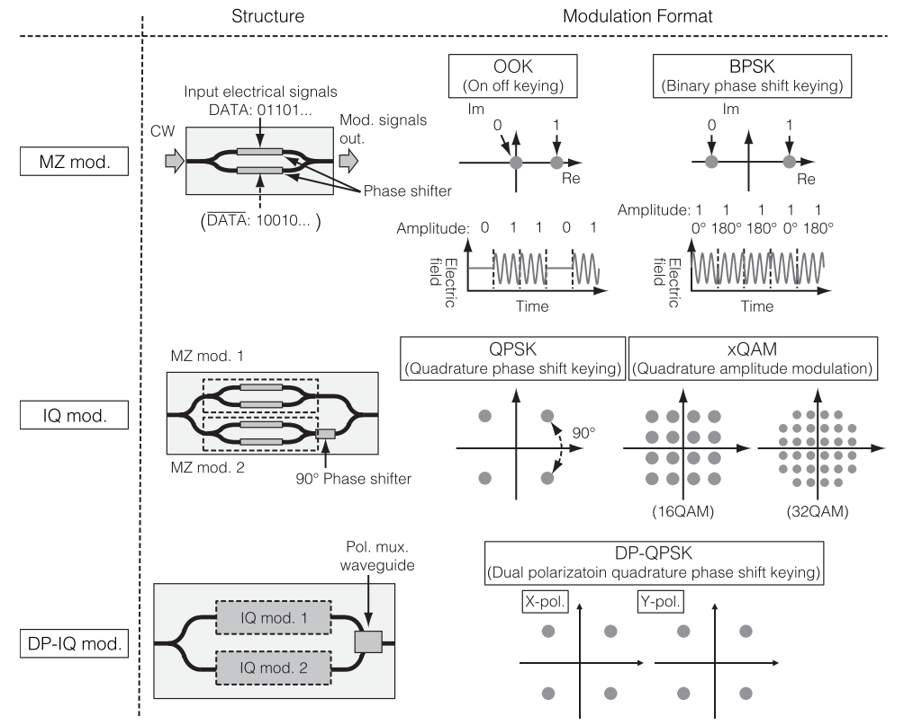
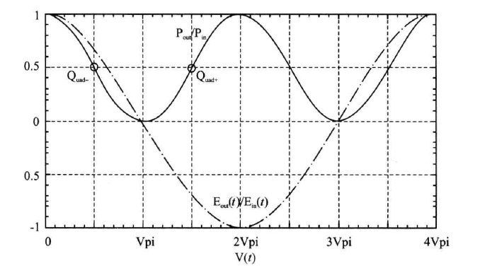
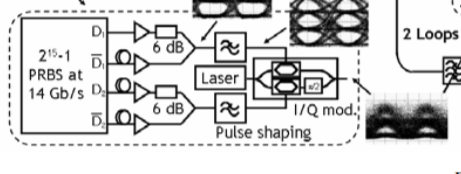
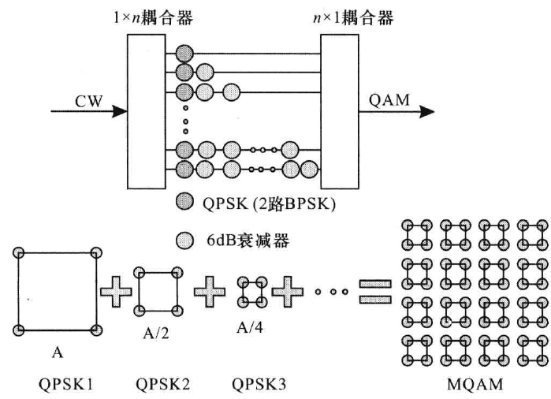
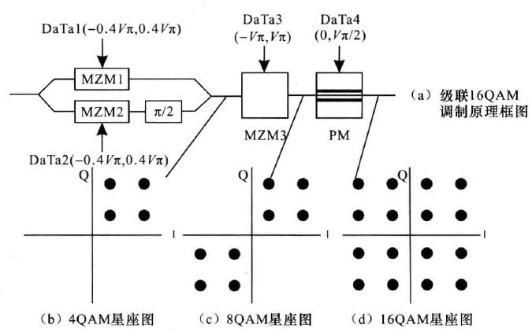

## **1.电光效应**

### **1.1 普克尔效应和克尔效应**

#### 1.1.1 普克尔（Pockels）效应

​		折射率的变化和所加电场成正比，也称为线性电光效应。--很多材料

#### 1.1.2 克尔（Kerr）效应

​		折射率的变化和所加电场的平方成正比，也称为二次电光效应。--一些中心对称结构的材料

#### 1.1.3 电光材料的折射率$n(E)$ 

​		电光材料的折射率$n(E)$ 是外电场振幅$E$的函数，在$E=0$处泰勒展开，则有
$$
n(E)=n+a_1E+\frac{1}{2}a_2E^2+...\quad(1.1.1)
$$
​		定义电光系数$\gamma=-2a_1/n^3,\xi=-a_2/n^3$,则（1.1.1）改写为
$$
n(E)=n-\frac{1}{2}\gamma n^3E-\frac{1}{2}\xi n^3E^2...\quad(1.1.2)
$$

​		（1.1.2）写成有关反介电常数$\eta$的表达式，其中$\eta=\varepsilon_0/\varepsilon=1/n^2\quad(n=\sqrt{\varepsilon_r})$，则有
$$
\eta(E)=\eta+\Delta\eta=\eta+\gamma E+\xi E^2\quad(1.1.3)
$$

​		其中$\gamma$为普克尔系数或线性电光系数，$\xi$为克尔系数或二次电光系数。

### **1.2 晶体中的电光效应**

#### 1.2.1 折射率椭球

​		对于各向异性晶体，设反介电常数张量$\vec\eta$的元素为$\eta_{ij}=\eta_{ji}=1/n_{ij}^2$，晶体中的折射率椭球表示为
$$
\sum_{ij}\eta_{ij}x_ix_j=1,\quad i,j=1,2,3\quad(1.2.1)
$$
​		当施加电场时，反介电常数在$E=0$处泰勒展开，得到
$$
\eta_{ij}(\vec E)=\eta_{ij}+\sum_{k}\gamma_{ijk}E_k+\sum_{kl}\xi_{ijkl}E_kE_l\quad i,j,k,l=1,2,3\quad (1.2.2)
$$
​		其中$E_k(k=1,2,3)$为电场$\vec E$在椭球三个主轴方向的三个分量。 

#### 1.2.2 张量$\vec\gamma$和$\vec\xi$独立元素

​		张量$\vec\gamma$独立元素：由于$\eta$的对称性$\eta_{ij}=\eta_{ji}$，$\gamma_{ijk}$的独立元素由27（3\*3\*3）个减少为18（3\*2\*3）个。将$(i,j)$的变化用变量$I$来代替，故$\gamma_{ijk}$变为$\gamma_{Ik}$，$\gamma_{Ik}$为6\*3矩阵，$I=1,2,...,6$

​		同理，张量$\vec\xi$独立元素：$\xi_{ijkl}$的独立元素由81（3\*3\*3\*3）个减少为36（3\*2\*3\*2）个。将$(i,j)$的变化用变量$I$来代替，将$(k,l)$的变化用变量$J$来代替，故$\xi_{ijkl}$变为$\xi_{IJ}$，$\xi_{IJ}$为6\*6矩阵，$I,J=1,2,...,6$

#### 1.2.3 晶体中的电光效应

​		线性电光效应：20种无对称中心的晶体

​		二次电光效应：各种对称类型的晶体（有无对称中心均可），各向同性晶体（在电场作用下会变成各向异性）

|   材料    |  点群  | $\lambda_0/\mu m$ |            $\gamma_{lm}\\/10^{-12}m\cdot V^{-1}$             |          $n$           |             $n^3\gamma\\/10^{-12}m\cdot V^{-1}$              |            $\varepsilon/\varepsilon_0$             | 透光波段               |
| :-------: | :----: | :---------------: | :----------------------------------------------------------: | :--------------------: | :----------------------------------------------------------: | :------------------------------------------------: | ---------------------- |
| $LiNbO_3$ | 3m[^1] |       0.633       | $\gamma_{33}=30.8\\\gamma_{13}=8.6\\\gamma_{22}=3.4\\\gamma_{51}=28$ | $n_o=2.286\\n_e=2.200$ | $n_e^3\gamma_{33}=328\\n_o^3\gamma_{22}=87\\(n_e^3\gamma_{33}-n_o^3\gamma_{22})/2=122$ | $\varepsilon\perp c=98\\\varepsilon\parallel c=50$ | $0.42\mu m-\\4.2\mu m$ |

[^1]: 3m类晶体为单轴晶体，其折射率椭球中的三个主折射率分别为$n_1=n_2=n_o,n_3=n_e$。

#### 1.2.4 线性电光效应的计算方法

​		把（1.2.1）改写为
$$
\eta_{11}(E)x_1^2+\eta_{22}(E)x_2^2+\eta_{33}(E)x_3^2+2\eta_{23}(E)x_2x_3+2\eta_{13}(E)x_1x_3+2\eta_{12}(E)x_1x_2=1\quad(1.2.3)
$$
​		只考虑普克尔效应，（1.2.2）简化为
$$
\eta_{ij}(\vec E)=\eta_{ij}+\sum_{ijk}\gamma_{ijk}E_k=\eta_{ij}+\Delta\eta_{ij}\quad(1.2.4)
$$
其中$\Delta\eta_{ij}$可表示为矩阵形式，即
$$
\left[
\begin{matrix}
\Delta\eta_{11}\\
\Delta\eta_{22}\\
\Delta\eta_{33}\\
\Delta\eta_{23}\\
\Delta\eta_{13}\\
\Delta\eta_{12}
\end{matrix}
\right]=
\left[
\begin{matrix}
\gamma_{11} & \gamma_{12} & \gamma_{13}\\
\gamma_{21} & \gamma_{22} & \gamma_{23}\\
\gamma_{31} & \gamma_{32} & \gamma_{33}\\
\gamma_{41} & \gamma_{42} & \gamma_{43}\\
\gamma_{51} & \gamma_{52} & \gamma_{53}\\
\gamma_{61} & \gamma_{62} & \gamma_{63}
\end{matrix}
\right]=
\left[
\begin{matrix}
E_1\\E_2\\E_3
\end{matrix}
\right]\quad(1.2.5)
$$
**e.g.计算3m类晶体加电场后的折射率椭球的变化，设外场$\vec E$的方向和晶体光轴方向相同。**

**Solve：**

$\vec E=(0,0,E)$，则有
$$
[\Delta\eta_{11},\Delta\eta_{22},\Delta\eta_{33},\Delta\eta_{23},\Delta\eta_{13},\Delta\eta_{12}]=[\gamma_{13}E,\gamma_{13}E,\gamma_{33}E,0,0,0]
$$
折射率椭球方程变为
$$
（\eta_{11}+\gamma_{13}E）x_1^2+（\eta_{22}+\gamma_{13}E）x_2^2+（\eta_{33}+\gamma_{33}E）x_3^2=1
$$
由于$\eta_{11}=\eta_{22}=1/n_o^2,\eta_{33}=1/n_e^2$，因此上式可表示为
$$
（\frac{1}{n_o^2}+\gamma_{13}E）(x_1^2+x_2^2)+(\frac{1}{n_e^2}+\gamma_{33}E)x_3^2=1
$$
由上式知，施加电场后，折射率椭球的方向不变，但折射率发生变化，有
$$
\frac{1}{n_o^2(E)}=\frac{1}{n_o^2}+\gamma_{13}E=\frac{1+n_o^2\gamma_{13}E}{n_o^2}\\
\frac{1}{n_e^2(E)}=\frac{1}{n_e^2}+\gamma_{33}E=\frac{1+n_e^2\gamma_{33}E}{n_e^2}
$$
通常电光效应引起的折射率变化相对较小，满足$n_o^2\gamma_{13}E\ll1$，可得
$$
n_o(E)\approx n_o-\frac{1}{2}n_o^3\gamma_{13}E\\
n_e(E)\approx n_e-\frac{1}{2}n_e^3\gamma_{33}E\\
$$
可见在外电场的作用下，折射率椭球缩小。

### **1.3 电光调制器**

​		纵向调制器、横向调制器、行波调制器；位相调制器、偏振调制器、光强调制器、角度扫描调制器

#### 1.3.1 位相调制器

​		光通过长度为$L$的普克尔盒，位相变化为
$$
\varphi=n(\vec E)k_0L=\frac{2\pi}{\lambda_0}n(\vec E)L\approx\frac{2\pi}{\lambda_0}n_0L-\pi\frac{\gamma n^3EL}{\lambda_0}\quad(1.3.1)
$$
​		普克尔盒上所加的电压为$V$，间距为$d$，则$E=\frac{V}{d}$，（1.3.1）写为
$$
\varphi=\varphi_0-\pi\frac{V}{V_\pi}\quad(1.3.2)
$$
其中，$\varphi_0=\dfrac{2\pi}{\lambda_0}n_0L$，$V_{\pi}=\dfrac{d}{L}\dfrac{\lambda_0}{\gamma n^3}$称为半波电压，当外加电压为$V_{\pi}$时，位相的变化为$\pi$。若为纵向调制器，则电极间距与调制器长度相等，即$d=L$。

#### 1.3.2 可调位相延迟器（偏振态调制器）

​		偏振光的两个正交分量分解到折射率椭球的两个主折射率轴（$n_1,n_2$），两个分量的传播速度不同（$c_0/n_1,c_0/n_2$）导致位相延迟，从而改变光的偏振态。

​		各向异性材料上加外场$\vec E$时，对于普克尔效应，两个偏振分量的折射率分别为
$$
n_1(\vec E)\approx n_1-\frac{1}{2}\gamma_1n_1^3E\quad(1.3.3a)\\
n_2(\vec E)\approx n_2-\frac{1}{2}\gamma_2n_2^3E\quad(1.3.3b)
$$
​		光通过长度为$L$的调制器，两个偏振分量产生的位相差为
$$
\Gamma=[n_1(\vec E)-n_2(\vec E)]k_0L=k_0(n_1-n_2)L-\frac{1}{2}k_0(\gamma_1n_1^3-\gamma_2n_2^3)L\quad(1.3.4)
$$
​		外加电场$E=\frac{V}{d}$，（1.3.4）写为
$$
\Gamma=\Gamma_0-\pi\frac{V}{V_\pi}\quad(1.3.5)
$$
其中，$\Gamma_0=(n_1-n_2)k_0L$为器件本身的位相差，$V_{\pi}=\dfrac{d}{L}\dfrac{\lambda_0}{\gamma_1n_1^3-\gamma_2n_2^3}$称为半波电压。

#### 1.3.3 光强调制器

##### 干涉法

​		以典型的马赫-曾德（Mach-Zehnder）干涉仪为例，在干涉仪其中一个臂中加入一个位相调制器，则出射端的干涉光强为
$$
I_0=\frac{1}{2}I_i+\frac{1}{2}I_icos\varphi=I_icos^2\frac{\varphi}{2}\quad(1.3.6)
$$
​		将干涉仪看作一个元部件，则器件的透过率为
$$
T=\frac{I_o}{I_i}=cos^2\frac{\varphi}{2}\quad(1.3.7)
$$
其中$\varphi=\varphi_1-\varphi_2$，$\varphi_1,\varphi_2$分别是光通过臂1和臂2的位相。对于臂1，$\varphi_1=\varphi_{10}-\pi\dfrac{V}{V_\pi}$，则
$$
\varphi=\varphi_1-\varphi_2=\varphi_0-\pi\frac{V}{V_\pi}\quad(1.3.8)
$$
其中$\varphi_0=\varphi_{10}-\varphi_2$，则器件的透过率为
$$
T(V)=cos^2(\frac{\varphi_0}{2}-\frac{\pi}{2}\frac{V}{V_\pi})\quad(1.3.9)
$$

##### 偏振调制法

​		把一个可调位相延迟器放在一对正交的偏振片之间，

## **2.基本结构的光调制器**

### **2.1  MZ mod**.

​		MZ调制器（MZM）的传输函数如下：
$$
E_{out}(t)=E_{in}(t)\cdot\frac{1}{2}\cdot(e^{j\varphi_1(t)}+e^{j\varphi_2(t)})\quad(2.1.1)
$$
其中，$\varphi_1(t)$和$\varphi_2(t)$是MZM上臂和下臂的相移。上下臂的相移可表示为：
$$
\varphi_1(t)=\frac{u_1(t)}{V_{\pi1}}\pi,\varphi_2(t)=\frac{u_2(t)}{V_{\pi2}}\pi\quad(2.1.2)
$$
其中，$V_{\pi1}$和$V_{\pi2}$是MZM上下臂的半波电压，$u_1(t)$和$u_2(t)$是上下臂的外接电压，包括射频驱动电压和直流偏置电压。

​		当MZM工作在push-push模式，上下臂的相移相同，只是增加了相移，对信号仍是相位调制。

​		当MZM工作在push-pull模式（常用工作模式），双臂相移相反，即$\varphi_1(t)=-\varphi_2(t)$，$u_1(t)=-u_2(t)=1/2u(t)$，此时如上图MZ mod.所示。输出端为强度调制的光信号，表示为：
$$
E_{out}(t)=\frac{1}{2}\cdot E_{in}(t)\cdot(e^{j\varphi_1(t)}+e^{j\varphi_2(t)})\\
=E_{in}(t)\cdot cos[\frac{\Delta\varphi_{MZM}(t)}{2}]\\
=E_{in}(t)\cdot cos[\frac{u(t)}{2V_{\pi}}\pi]\quad(2.1.3)
$$
​		当进行强度调制时（如上图的OOK），调制器的直流偏置要在正交位置，即$V_{\pi}/2$，驱动电压变化范围为$0-V_{\pi}$。

​		当直流偏置在功率传输函数最低点时，即$V_\pi$，驱动电压变化范围为$2V_{\pi}$，当驱动电压经过最低点时，有$\pi$相移（如上图的BPSK）。

​		一个MZM典型的传输函数曲线如下：

### **2.2  IQ mod.**

​		IQ调制器有两个MZM和一个90°相移器组成，同相分路和正交分路的MZM工作在push-pull模式，且直流偏置在功率传输函数的最低点。同相分路和正交分路中MZM产生的相差为：
$$
\varphi_I(t)=\frac{u_I(t)}{V_{\pi1}}\pi,\varphi_Q(t)=\frac{u_Q(t)}{V_{\pi2}}\pi\quad(2.2.1)
$$
​		IQ调制器的传输函数可表示为：
$$
E_{out}(t)=\frac{1}{2}\cdot E_{in}(t)\cdot[cos(\frac{\varphi_I(t)}{2})+jcos(\frac{\varphi_Q(t)}{2})]\quad(2.2.2)
$$

#### 2.2.1 QPSK实现方式

- 并联式：DP-MZM产生两路BPSK信号，正交的BPSK信号干涉产生QPSK
- 级联式：MZM+PM，利用$0.5\pi$相位调制器的旋转作用下实现的

#### 2.2.2 16QAM实现方式

- 四阶强度信号+IQ调制：任意波形发生器AWG产生四阶强度信号，IQ调制产生$0-\pi/2$区间的星座点，同时AWG驱动级联的相位调制器PM，使IQ调制器输出的光信号发生旋转。

  

- QPMZM：两个BPSK信号合成一路QPSK（QPSK1、QPSK2）信号，通过衰减使两路QPSK信号具有不同的幅度，使两路QPSK信号耦合产生16QAM信号。

  

- 级联结构：DP-MZM产生直角4QAM，$(0,\pi)$的相位调制器MZM产生特殊8QAM，$(0,\pi/2)$的相位调制器旋转作用产生16QAM。

  

### **2.3 DP-IQ mod.**

### **2.4 QMZM-IQ**

实现16QAM