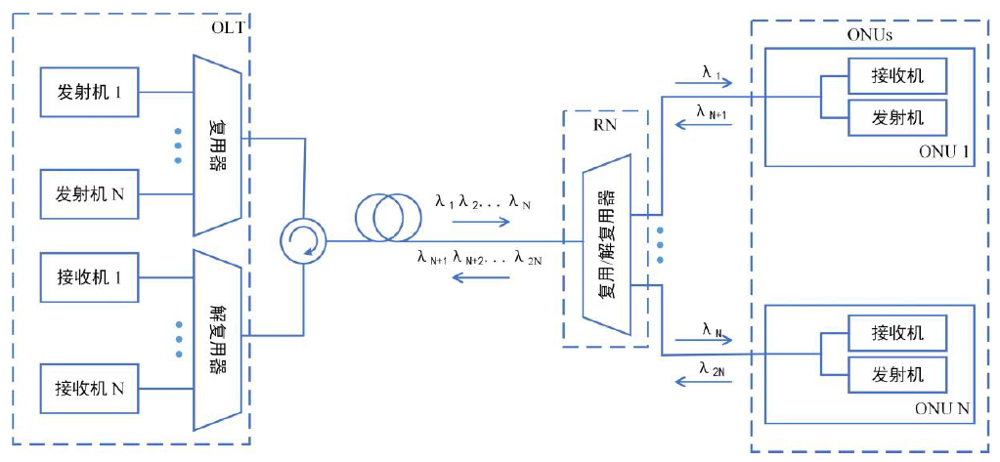

# **光网络**

## **网络概念**

### 网络术语

- **站**

  网络用户用以通信的设备都称为站，如计算机、监控设备、电话、传真机等

- **网络**

  站点之间以及其中的传输路径所形成的互连站点集合

- **节点**

  网络内部一个或多个通信线路终端和/或站点之间相连的点

- **中继线**

  通常指节点之间或网络之间相连的传输线路，支持大容量传输

- **拓扑**

  形成网络的逻辑描述方式

- **交换与路由**

  - 交换：通过一系列中间节点实现从源站到宿站的信息传递过程
  - 路由：在网络中选择一条合适的路径

### 网络分类

- **局域网（LAN，Local Access Network）**
  - LAN连接的用户都在一个相对有限的区域，如工作区、公寓区等
  - 以太网是LAN最流行的技术
  - LAN通常由单个组织所独立拥有、使用和操作
- **园区网**
  - 园区网是LAN的扩展，可看做是一个有限区域内多个LAN的组合
  - 园区网由本地区域某个组织所独立拥有、使用和操作
- **城域网（MAN，Metro Access Network）**
  - 覆盖一个城市的网络
  - 其覆盖范围大于园区网和LAN，MAN中心交换局之间的距离可以从**几千米到几十千米**
  - MAN资源一般由多个电信公司所共同拥有和使用
- **接入网**
  - 接入网位于MAN和LAN/园区网之间
  - 接入网的作用之一是集中来自LAN的信息流并将其发送到交换设备（上行数据流），另一个传输方向（下行数据流）为用户提供话音、数据、视频等服务
  - 传输距离可达**20km**
- **广域网（WAN，Wide Access Network）**
  - WAN覆盖一个非常大的地理范围，传输范围包括相邻城市之间的交换设备的连接、长途跨国的陆路连接和各大洲之间的海底链路连接
- **专用网和公用网**
  - 专用网：专门组织拥有和控制的网络，只为组织内部成员提供服务
  - 公用网：电信公司所拥有的网络为大众提供租用线路或者实时电话连接
    - 中心局：公共网中放置中心交换设备的场所
    - 干线：网络中连接多个网络部分的链路，干线可能很长，也可能很短
    - [无源光网络（PON，Passive Optical Network）](#无源光网络-PON)：在接入网不需要任何有源电子器件的光分配网，是FTTP（光纤到驻地）型网络的基础

### 网络层次

以**开放系统互联参考模型（OSI）**为例

- **物理层**

  提供具有一定带宽的物理传输媒介，如铜线或光纤，为通信设备提供各种不同类型的物理接口

- **数据链路层**

  建立、维持和释放直接向量与两个节点的链路，功能包括封装（定义传输数据的结构）、复用和解复用数据

- **网络层**

  通过多个网络链路把数据分组从源端传送到目的端，主要的网络层协议是因特网协议（IP）

- **传输层**

  把完整的信息可靠地从源端发送到目的端，因特网中应用的传输控制协议（TCP）是传输层协议的一个例子

- **更高层**

  会话层、表示层、应用层

### 光层

- ​	光层是基于波长的概念，位于物理层的上一层，即物理层提供了两个节点间的物理连接，光层在链路上提供光通道服务
  
> 一个8信道WDM链路有8个光通道，却在同一个物理线路上传输

- 光层可以实现波分复用（WDM）、分插复用（ADM）、光交叉连接（OXC）、波长交换（WC）

## **网络拓扑**

- **总线型**

  

- **环型**

  

- **星型**

  

- **网状型**

  

## **无源光网络 PON**

- 在网络传输路径上中只有无源光器件用来引导特定的光波长传输到用户终端和回到中心局，有源器件仅存在中心局和用户端

- PON建立在**CWDM技术**和**单根光纤双向传输**的基础上

  

### 基本的PON架构

- 中心局到分路器
  - **上行**
    - **1310nm**：数据和声音（一个特定PON的所有用户分享1310nm上行波长）
  - **下行**
    - **1490nm**：数据和声音
    - **1550nm**：视频
- 分路器
  - 无源分路器简单地将光功率分成$N$路，每个用户的功率为$\frac{P}{N}$
  - 常用的分路数为8、16、32
- PON实现方案
  - **宽带PON（BPON）**
  - **以太网PON（EPON）**或**吉比特以太网（GE-PON）**
  - **吉比特PON（GPON）**
  - **[WDM PON](#WDM-PON架构)**

### 有源PON模块

- **光线路终端（OLT）**
  - OLT位于中心局，控制网络中信息的双向流动
- **光网络终端（ONT）**
  - ONT直接位于用户端，提供与PON的上行方向的光连接和为本地的用户提供电接口
  - ONT的尺寸范围可以从挂在房子外面的简单箱子，到置于大型公司或办公楼内的标准电子机架单元
- **光网络单元（ONU）**
  - ONU与ONT相似，但通常位于室外靠近用户位置的护箱中，安装在办公区的中心或侧边
  - ONU设备必须适应环境，能够承受大范围的温度变化

### [WDM PON架构](https://baike.baidu.com/item/WDMPON/8709540?fr=aladdin#2)

- 每个ONT使用一个单独的波长，每个ONT能在共享的上行光纤中连续发送信息，而不用等待特定的预设时隙
- **优点**
  - 提供较宽的工作带宽，实现真正意义上的对称宽带接入
  - 用户的高带宽需求在不影响其他用户的前提下很容易满足
  - 使用专用的波长具有更高等级的信息安全性
- **OLT光源**
  - DFB激光器阵列
  - 多频激光器
  - 比特交错光源
- **ONT光源**
  - DFB激光器阵列
  - 回环
  - **光谱分割**
    - ONT的发送机中包含宽谱光源（超辐射发光二极管 SLED）
    - 中心局使用宽带光源（宽带EDFA光源），OLT和ONT使用波长锁定FP激光器
  - 其他
    - 反射型半导体光放大器（RSOA）或反射型电吸收调制器在ONT上产生特有波长的源，用来传输上行数据流

