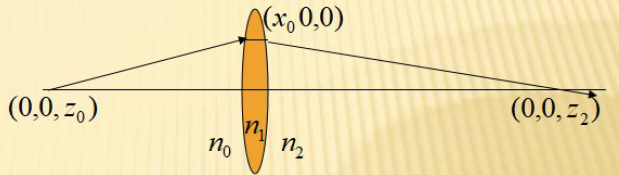
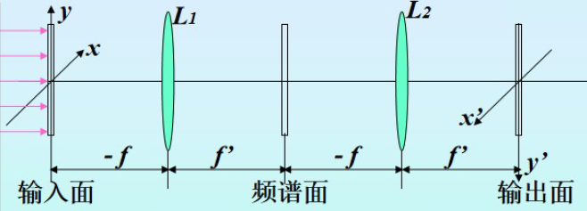
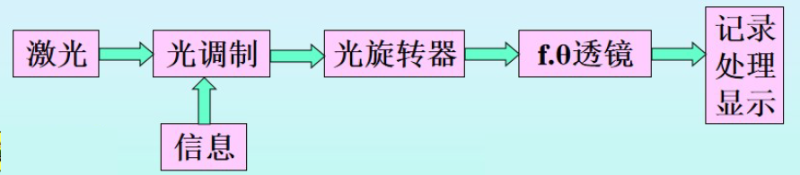

# 光学系统设计

## 1. 光学系统像质评价

### 1.1 概述

#### 1.1.1 分辨率检验

- 分辨率：光学系统成像时所能分辨的最小间隔$\delta$
- 空间频率：$\delta$的倒数$\mu=\dfrac{1}{\delta}$，单位：lp/mm（线对每毫米）

### 1.2 光学系统的建模

#### 1.2.1 渐晕现象

- 渐晕：轴外光束的口径比轴上点光束的口径小，导致轴外像点能量比轴上像点能量小，轴外像点比轴上像点暗

#### 1.2.2 人为给定渐晕的原因

- 为保证轴外点的成像质量，把轴外子午光束的宽度适当减小
- 从系统外形尺寸上考虑，减小某些元件的尺寸

#### 1.2.3 人为给定渐晕的两种方式

- 渐晕系数法
- 给出系统中每个通光孔的实际通光半径

### 1.3 几何像差

#### 1.3.1 色散

- 色散：某一种介质对两种不同颜色光线的折射率之差$n_{\lambda_1}-n_{\lambda_2}$
- 中部色散：某一种介质对F（486.13nm）光和C（656.28nm）光的折射率之差$n_{\lambda_F}-n_{\lambda_C}$

#### 1.3.2 色差

- 轴向色差（位置色差）：不同颜色像点沿光轴方向的位置之差

- 垂轴色差（倍率色差）：不同颜色像对应大小之差

- 对复色光成像的仪器要求
  
  - **对主色光校正单色像差，对成像光谱的两端校正色差**
  
  - 色差校正后，它们和主色光之间仍有色差，即二级光谱
  
- 色差的消除
  - 采用不同色散不同折射率玻璃的组合（适用于某一孔径、某一视场）
  - 采用折射元件和衍射元件混合的技术
  - 采用反射镜（最有效方法，适用于大孔径、大视场）

#### 1.3.3 球差

- 定义：**轴上物点**发出的不同孔径光线通过光学系统后，其聚焦点对理想像点的位置之差（单色像差）
- **正透镜恒产生负球差，负透镜恒产生正球差，当入、出射光线关于透镜对称时，球差取得极值（绝对值最小），此时的透镜形状为最小球差形状**
- 平行平板恒产生正球差，当且仅当平行光正入射时不产生
- 球差的校正
  - 加光阑
  - 复合透镜，如正负透镜组合、球面曲率及折射率的配合等（**单个球面薄透镜不可能消球差**）
  - 非球面透镜
  - 变折射率透镜（成像精度不足，常用于通信通讯方面）

#### 1.3.4 轴外像点的单色像差

- 子午面：主光线和光轴决定的平面

- 弧矢面：过主光线和子午面垂直的平面

- **子午（弧矢）慧差**：子午（弧矢）光线对交点到主光线的距离

  - 子午慧差：上下光线的交点偏离主光线
  - 弧矢慧差：前后光线的交点偏离主光线
  
  > 慧差：靠近光轴的物点发出的大孔径光线不聚焦于一点

- 子午（弧矢）场曲：子午（弧矢）光线对交点到理想线面的距离

- 轴外子午（弧矢）球差：子午（弧矢）宽光束交点到细光束交点的距离

- 正弦差：慧差与相高的比值

- **畸变**：成像光束的主光线的实际像高和理想像高之差（畸变不影响像的清晰，只影响像的变形）

  - 畸变与光阑位置有关
    - 全对称系统（结构对称、物像对称），不产生畸变
  - 孔阑与之重合的接触薄系统，不产生畸变（主光线通过系统中心，沿理想方向射出）
    - 对于单薄透镜，光阑前移——负畸变，光阑后移——正畸变
  
  > 正畸变（枕形畸变）*（凹进去）*
  >
  > 负畸变（桶形畸变）*（凸出去）*

- 垂轴像差：包括子午垂轴像差和弧矢垂轴像差

#### 1.3.5 像散和像面弯曲

- 匹兹凡面弯曲：像散为零时的像面弯曲
  - 正负光焦度的分离是校正匹兹凡和的唯一方法

#### 1.3.6 像差曲线

- 几何像差曲线

- 垂轴像差曲线

  > 最大弥散范围还不足以全面反映系统的成像质量，还要看光能是否集中

### 初级像差与孔径、视场的关系小结

- 球差、位置色差：与孔径有关
- 慧差：与孔径、视场有关
- 像散、场曲：对细光束，与视场有关；对宽光束，与孔径、视场都有关
- 畸变：与视场有关
- 各种像差均可展开成孔径、视场的级数
- 孔径增大，宽光束像差大且难以校正；视场增大，轴外像差大且难以校正

### 1.4 波像差和分辨率

#### 1.4.1 波像差

- 定义：实际波面和理想波面之间的光程差
- 用波像差评价光学系统的成像质量：$\frac{1}{4}$波长

#### 1.4.2 分辨率

- 瑞利判据：两像点间能够分辨的最短距离约等于中央亮斑半径
  $$
  R=\frac{0.61\lambda}{NA}
  $$

- 望远镜分辨率：用能分辨开的两个物点对物镜张角$\alpha$表示
  $$
  \alpha=\frac{1.22\lambda}{D}
  $$

- 照相系统分辨率：用像平面上每毫米能分辨开的线对数$N$表示
  $$
  N=\frac{1}{1.22\lambda F}~~(lp/mm)
  $$

- 显微镜分辨率：用物平面上刚能分辨开的两个物体间的嘴短距离$\sigma$表示
  $$
  \sigma=\frac{0.61\lambda}{NA}
  $$

### 1.5 光学传递函数及其它像质评价指标

#### 1.5.1 光学传递函数 OTF

> 光学传递函数是目前公认的最能充分反映系统实际成像质量的评价指标

$$
OTF(\mu)=MTF(\mu)e^{iPTF(\mu)}
$$

- 振幅传递函数$MTF(\mu)$：像平面和物平面振幅之比
  $$
  MTF(\mu)=\frac{a'}{a}
  $$

- 位相传递函数$PTF(\mu)$：像平面和物平面初位相之差
  $$
  PTF(\mu)=\theta_\mu
  $$

- 两个系统构成的组合系统，$MTF$等于两个分系统$MTF$值的乘积
  $$
  MTF(\mu)=MTF_1(\mu)\cdot MTF_2(\mu)
  $$

#### 1.5.2 其他像质评价指标

- Spot Diagram（像点弥散图）：光线直接追迹到像平面
- Encircled Energy（包围圆能量）：以像面上主光线或中心光线为中心，以离开此点的距离为半径做圆，以落入此圆的能量和总能量的比值来表示

### 1.6 [光阑与光瞳]([入瞳、出瞳与光阑的位置 - 百度文库 (baidu.com)](https://wenku.baidu.com/view/1719a3551ed9ad51f01df266.html))

## 2. 校正场曲的光学系统

### 2.1 正、负光焦度远离的薄透镜系统

例如一个为正透镜，一个为负透镜，它们的光焦度大小相等符号相反，适当选择透镜之间的间隔$d$，可以获得所要求的组合光焦度

### 2.2 弯月形厚透镜

一个弯月形厚透镜相当于一个平凸透镜和一个平凹透镜，中间加一块平行玻璃板，它等效于两个分离薄透镜，因此能校正场曲

## 3. 照相物镜设计

### 3.1  照相物镜特点

- 焦距 $f'$：照相物镜的焦距，短的只有几毫米，长的可达2~3m或更长

- 相对孔径 $D/f'$：主要影响像面照度，大相对孔径的物镜提高像面照度

- 视场角 $2\omega$：小的只有2$^{\circ}$~ 3$^{\circ}$，大的可能达到140$^{\circ}$

#### 3.1.1 $f'$，$D/f'$和$2\omega$三个光学特性的相互制约

  > 无限远物体的理想像高公式：$y'=-f'~tan~\omega$

- 若系统的焦距增加，相对孔径和视场将随之下降
- 在焦距相近的条件下，视场大，相对孔径便小

## 4. 高斯光学

### 4.1  费马原理

- 定义：光从一点到另一点是**沿光程为极值**的路径传播，该定理又称**极端光程定律**

  > 光程$s=nl=ct$，$s=\int_A^B ds=\int_A^B n\cdot dl$

- **表达式**
  $$
  \delta s=\delta\int_A^B n\cdot dl=0
  $$

- 以**平面为界面**的情况下，光线按光程为**极小值**的路径传播

- 以**曲面为界面**的情况下，光线可能按光程为**极小、极大或常量**的路径传播

  - 对于**椭球反射面**，**一焦点**$F$出的所有光线经该面反射后必聚焦在**另一焦点**$F'$，且**光程为常量**
    - 对于**球面反射镜**，光路对应**光程极大值**

#### 4.1.1 拉格朗日表述

$$
\delta\int_P^Qn(x,y,z)\sqrt{1+\left(\frac{dx}{dz}^2\right)+\left(\frac{dy}{dz}^2\right)}dz=0
$$

- 光学拉格朗日量
  $$
  L(x,y,\frac{dx}{dy},\frac{dy}{dy},z)=n(x,y,z)\sqrt{1+\left(\frac{dx}{dz}^2\right)+\left(\frac{dy}{dz}^2\right)}
  $$

- **光线方程式**
  $$
  \frac{d}{ds}\left(n\frac{d\vec r}{ds}\right)=\nabla n
  $$
  $\vec r$是光线上任意点的位置矢量

- **近轴光线方程式**（$ds\approx dz$）
  $$
  \frac{d}{dz}\left(n\frac{d\vec r}{dz}\right)=\nabla n
  $$

#### 4.1.2 哈密顿表述

*便于求理想光路，也便于计算各种像差*

- 光学哈密顿量
  $$
  H=p\dot{x}+q\dot{y}-L(x,y,\dot{x},\dot{y}.z)
  $$
  
- 光学方向余弦

  $p$，$q$分别为折射率乘以各个方向余弦
  $$
  p=n\frac{dx}{ds}\\
  q=n\frac{dy}{ds}
  $$

### 4.2 高斯光学

*利用哈密顿方程式研究旋转对称光学系统中的高斯光学*

> 旋转对称光学系统——共轴光学系统
>
> **高斯光学**——哈密顿方程式最低阶的近似解，也叫**近轴光学**

- **单个折射球面的近轴物像位置关系公式**

  
  $$
  \frac{n_2}{z_2}-\frac{n_1}{z_1}=\frac{n_2-n_1}{R}
  $$

  - 第一焦距
    $$
    z_2\to\infty,z_1=-\frac{n_1R}{n_2-n_1}
    $$

  - 第二焦距
    $$
    z_1\to-\infty,z_2=\frac{n_2R}{n_2-n_1}
    $$

- **薄透镜**（两折射面之间的距离可忽略的透镜）公式

  
  $$
  \frac{n_0}{z_0}-\frac{n_2}{z_2}=\frac{n_1-n_2}{R_2}-\frac{n_1-n_0}{R_1}
  $$

  - 一般，透镜两边介质相同，则有**透镜焦距**$f'$
    $$
    \frac{1}{z_2}-\frac{1}{z_0}=(n-1)(\frac{1}{R_2}-\frac{1}{R_1})=\frac{1}{f'}
    $$

- **厚透镜**（厚度与其他参数相比不能忽略）

### 4.3 程函方程式

$$
(\nabla S)^2=n^2
$$

其中，$S$是空间坐标$(x,y,z)$的实函数，$S(x,y,z)=const$的面表示波面，即该面上相位一定

- 可由程函方程式推导出[光线方程式](#_411-拉格朗日表述)（费马原理的拉格朗日表述）

## 5. 初级像差理论

> 高斯光学：光线无限接近于光轴并与光轴夹角无限小
>
> 像差：实际光学系统对有限大小物体以宽光束成像

### 5.1 初级像差表达式

- **唯一确定一条光线**
  - 某平面上的x，y，p，q值
  - 两个平面上的x，y值
  
- **两条近轴光线**

  - 一条是轴上物点发出、过入瞳边缘的第一近轴光线；

    另一条是物面边缘点发出、过入瞳中心的第二近轴光线

  - 作近轴光线的光路计算已确定像的理想状态，即高斯像的位置和大小
  - 利用近轴光线算出各种初级像差及其分布
    - 追迹第一近轴光线可得球差
    - 追迹第一和第二近轴光线可得其他像差

### 5.2 初级像差及其光束结构

- [球差](#_133-球差)
- [慧差](#_134-轴外像点的单色像差)
- [像散和像面弯曲](#_135-像散和像面弯曲)
- [畸变](#_134-轴外像点的单色像差)

### 5.3 梯度折射率介质的像差

- 对某种特定的光线，可以找到使其无像差的折射率分布
- 对于参与成像的所有光线，要找到无像差的折射率分布是不可能的，只能通过改变非均匀介质的参数来控制像差

## 6. 特殊面形及其光学系统设计

### 6.1 常用的非球面

- **二次曲面（Standard）**
- **旋转对称非球面（Odd asphere）**
- **旋转对称偶次非球面（Even asphere）**
- **非旋转对称**
  - **双曲率面（Biconic）**
  - **多项式非球面（Polynomial）**
  - **扩展多项式非球面（Extended Polynomial）**

### 6.2 旋转对称光学系统中非球面的应用

- **孔径光阑附近**的非球面对**轴上像差**贡献大
- **远离孔径光阑**的非球面对**轴外像差**贡献大

### 6.3 应用实例：手机镜头

**手机镜头设计特点**

- 传感像素小，Nyquist频率高
- 镜头结构受手机内部空间限制显著
- 非球面大量应用，包括extended非球面，自由度高，像差补偿关系复杂
- 光阑通常靠前，但某些超薄、大视场、大孔径镜头的入瞳位置随视场的变化关系复杂
- 为保证各视场像质良好，像质评价需要取10个以上视场
- 主光线角需要与传感器的主光线角曲线匹配，差异在一定范围内
- 对非球面镜片的公差分析与质量保证提出了更高的要求

### 6.4 特殊连续非球面在光学系统中的应用

- **柱面的应用**

  - 宽荧幕电影放映系统（两个方向具有不同的倍率）
  - 像散光束的校正

  > 单个柱面透镜两个方向的像不重合，必须成对使用，组成望远镜系统。
  >
  > 此时一个方向2倍放大，另一个方向相当于平板

- **一般双曲率面的应用**

  - 像散光束的产生与校正

## 7. 特殊光学系统

### 7.1 激光光学系统

- **高斯光束及其性质**
- **激光准直系统**

### 7.2 傅里叶变换光学系统

#### 7.2.1 光学透镜的傅里叶变换特性

- **夫琅禾费衍射**过程就是一个**傅里叶变换**过程，**衍射场即为频谱面**

- 在第一次变换后的**频谱面**上插入各种**空间滤波器**，从而**改变频谱**，就可达到光学图像处理之目的

- 物函数$f(x,y)$经二次傅里叶变换后，仍可得到原函数，只不过**函数的坐标正负号相反**

- 相干光学系统系统为**4f系统**

  

#### 7.2.2 傅里叶变换透镜的光学设计特点

- 必须**满足正弦条件**
- 必须对两对共轭位置校正像差，达到衍射极限
- 参照理想光学系统$y'=f'\tan\theta$必**产生畸变**$\delta y'=f'(\sin\theta-\tan\theta)$
  - 4f系统因成对使用，且对频谱面对称，**输出面上畸变自动消除**
- 一般设计成**小视场**、**小孔径**、**长焦距**系统

#### 7.2.3 傅里叶变换透镜的结构型式

- 单组双胶合或双分离
  - 很好地校正轴上像差，但存在轴外像差，视场和相对孔径较小
- 对称型反远距型
  - 主面外移，长焦距下减小外形尺寸，同样工作条件下物面、谱面尺寸增大，有利于校正轴外像差，但结构复杂，造价高

### 7.3 扫描光学系统

#### 7.3.1 两种结构

- 透镜前扫描
  - 大视场、小孔径系统
  - [线性成像透镜](#_732-线性成像透镜的特点)
  - 设计困难，处理简单
- 透镜后扫描
  - 小视场、小孔径系统
  - 设计简单，处理困难（因为像面是圆弧形）

#### 7.3.2 线性成像透镜的特点

- 理想像高与扫描角呈线性关系，即$y'=f'\theta$，故称$f\theta$透镜
- 与一般光学系统相比，应产生畸变$\delta y'=f'(\theta-\tan\theta)$
- 单色光成像，要求像质达衍射极限，整个像面为平面，像质一致，无渐晕
- 为像方远心光路（扫描器一般位于物方焦面），若再校正场曲，则可实现轴上、轴外像质一致，像点能精准定位

----

## Appendix

### 1. [双胶合透镜](https://baike.baidu.com/item/%E5%8F%8C%E8%83%B6%E9%80%8F%E9%95%9C/22140902?fr=aladdin )

- 双胶透镜是将两个透镜胶合在一起得到的透镜
- 这种用两个透镜形成的组合透镜是一种取得短焦长、大放大率和较好成像质量的有效方法，已在天文望远镜和照相机中广泛使用

> 凸透镜又叫正透镜，其中央部分比边缘厚；
>
> 凹透镜又叫负透镜，其中央部分比边缘部分薄。

### 2. [火石玻璃 & 冕玻璃](https://blog.csdn.net/strategycn/article/details/8554397)

- 火石玻璃（Flint Glass，缩写以F结尾）：氧化铅含量高于3%，折射率通常大于1.6，色散系数小于50
- 冕玻璃（Crown glass，缩写以K结尾）：氧化铅含量低于3%，折射率通常小于1.6，色散系数大于50

> 色散系数：也称阿贝数，数值越大，色散越小

- K代表冕牌，F代表火石，Z为重，B代表硼，Ba代表钡，L代表镧 ，P代表磷，N代表无铅

> 比如，双筒望远镜中广泛采用的BK7棱镜，其所用的材料是硼硅酸盐玻璃（borosilicate，德语为borkron)中的第7号

### 3.  [F数](https://baike.baidu.com/item/F%20%E6%95%B0/22129903?fr=aladdin)

- 定义：系统的像方焦距与入瞳直径之比，即相对孔径的倒数（$f'/D$），也叫光圈数
- 光圈数（F）和光圈是一个反比关系

> 光圈越大，进光量越多

- F值越小，镜头的适用范围越广