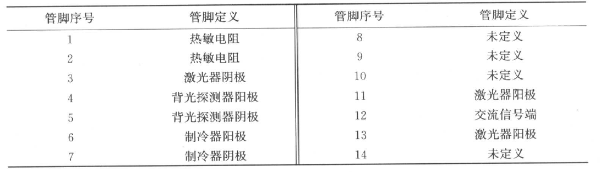

# 光电子器件封装 Packaging

## 1. 半导体激光器的封装设计

### 1.1 激光器封装类型

#### 1.1.1 TO（Transistor Outline; Through-hole）封装激光器

- 广泛应用于**2.5GB/s以下**LED、LD、光接收器件和组件的封装
- 特点
  - 寄生参数小、工艺简单、成本低、使用灵活方便
  - TO管壳内部空间很小，只有四根引线，**无法安装半导体制冷器**
- 种类
  - **插拔式封装（Pluggable）**
  
  - **窗口式封装（Window-can）**
  
  - **带尾纤式封装（Pigtailed）**
  
    

- 内部结构

  - 管壳内部有一个**激光器芯片（LD）**和一个**背光探测器芯片（monitor PD）**：管座上的探测器检测激光器的工作状况，探测器可接收到激光器背面发出的光，产生光电流，通过外电路的负反馈作用

    

  - 管脚引出线常见的有**四脚**和**三脚**两种

    > 在三条管脚的TO封装中，探测器和激光器共用一个接地管脚

    

#### 1.1.2 蝶型（Butterfly）封装激光器

- 目的：需要使用热敏电阻和制冷器组成的温控电路来保证激光器稳定工作

- 内部结构

  - 传统的蝶型管壳共有**14条管脚引线**

    - 11、12、13引脚组成了**地-信号-地（ground-signal-ground，GSG）型的共面微带线**，应用时是将其焊接在外部电路板上，由此**引入交流调制信号**

    

  - 蝶型管壳内包括激光器芯片、背光探测器芯片、**热敏电阻**、**制冷器**、**串联电阻**等
  
    - 热敏电阻：紧贴激光器芯片放置，**实时监测激光器芯片的温度**，反馈给外控制电路
  
    - 制冷器：受外控制电路驱动，**调节激光器温度**，使之保持在一个恒定的范围内
  
    - 串联电阻：在激光器芯片的交流回路中串联一个电阻实现**阻抗匹配**
    
      > 一般激光器驱动芯片的输出阻抗为25$\Omega$或50$\Omega$。
      >
      > 若驱动芯片输出阻抗25$\Omega$，激光器芯片交流阻抗大约5$\Omega$，则串联电阻等于20$\Omega$。

- 同轴型RF转接头的蝶形封装

  - 目的：**简化测试系统的同轴电缆到共面微带线的端口转换**

  - 用**同轴RF转接头（SMA或GPO）取代传统蝶型管壳的共面微带线结构**，与测试系统的同轴电缆相连

  - 特点

    - 高频SMA和GPO接头的**带宽**和**稳定性优于微带线**

    - 成本相对高一些

    - 常用于**高速激光器的封装**

#### 1.1.3 气密封装和子载体封装激光器

- 气密封装

  - **整体气密封装**
  - 光电子芯片和电子芯片都在其中
    
    - 存在相互干扰和影响，气密工艺复杂，成本较高
    
  - **气密小室封装/局部气密封装（Hermetic）**
  - 光电子芯片用气密小室（Capsule）封装技术，其他电子芯片采用非气密封装
    
    - 大大降低气密的难度，提高模块的气密可靠性

- 子载体封装

  - 模块内部只有部分电路和芯片具有高频要求，没必要将整个电路都制备在绝缘性能和导热性能好的高频基片上

