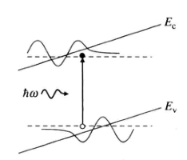
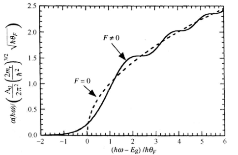

对于二粒子系统，通过坐标变换将电子和空穴的位置坐标变换成它们的相对坐标和质心坐标，在以下三种相互作用势下得出可能的解析解：

1. 只有外加电场，导致光在入射时引起电吸收效应 —— Franz-Keldysh效应
2. 电子和空穴之间的库仑相互作用，导致光在入射时引起激子吸收-—— 激子效应
3. 外加电场和激子效应同时存在，导致电吸收效应 —— 量子限制斯塔克效应

# Franz-Keldysh效应：光子辅助隧穿

## 原理

- 半导体带隙附近的光吸收过程：在均匀的外电场作用下，能带分布沿电场方向倾斜，一个能量略低于带隙能量的光子由于隧穿效应也可以被吸收。

  

- 导带电子和价带空穴的波函数可以穿透带隙，因此当光子能量低于电子能量时吸收谱存在一个吸收尾；带隙以上的吸收谱表现为随光子能量变化振荡的特性。

  

# 量子限制斯塔克效应（QCSE）

