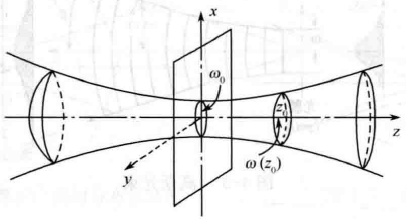

# 半导体光电子学 Semiconductor Optoelectronics

## 1. 光学谐振腔与高斯光束

### 1.1  矩阵光学简述

在光轴与入射光线组成的$yz$平面内，入射光线（$y_1,\theta_1$）和出射光线（$y_2,\theta_2$）在近轴光线的条件下（paraxial approximation：光束孔径角较小，$sin\theta\approx\theta$）的条件下：
$$
y_2=Ay_1+B\theta_1\tag{1.1.1}
$$

$$
\theta_2=Cy_1+D\theta_1\tag{1.1.2}
$$

其中，$A,B,C,D$是描述该光学系统作用的参数，上式可用矩阵表示
$$
\left[
\begin{matrix}
y_2\\
\theta_2
\end{matrix}
\right]=
\left[
\begin{matrix}
A & B\\
C & D
\end{matrix}
\right]
\left[
\begin{matrix}
y_1\\
\theta_1
\end{matrix}
\right]
$$
变换矩阵$\vec{M}=\left[\begin{matrix}A&B\\C&D\end{matrix}\right]$称为“光线传播矩阵”，简称$ABCD$矩阵。

*（符号规定：光线角度从$z$轴方向算起，光线指向光轴$z$上方$\theta$为正，指向光轴$z$下方$\theta$为负）*

#### 1.1.1 光学元件的传播矩阵

- 自由空间（传播距离$d$）

$$
\left[
\begin{matrix}
y_2\\
\theta_2
\end{matrix}
\right]=
\left[
\begin{matrix}
1 & d\\
0 & 1
\end{matrix}
\right]
\left[
\begin{matrix}
y_1\\
\theta_1
\end{matrix}
\right]\tag{1.1.3}
$$

- 平面边界的折射（两种介质$n_1,n_2$）

$$
\left[
\begin{matrix}
y_2\\
\theta_2
\end{matrix}
\right]=
\left[
\begin{matrix}
1 & 0\\
0 & \dfrac{n_1}{n_2}
\end{matrix}
\right]
\left[
\begin{matrix}
y_1\\
\theta_1
\end{matrix}
\right]\tag{1.1.4}
$$

- 平面反射镜的反射矩阵

$$
\left[
\begin{matrix}
y_2\\
\theta_2
\end{matrix}
\right]=
\left[
\begin{matrix}
1 & 0\\
0 & 1
\end{matrix}
\right]
\left[
\begin{matrix}
y_1\\
\theta_1
\end{matrix}
\right]\tag{1.1.5}
$$

#### 1.1.2 周期型光学系统的传播矩阵

基本单元的叠加组合形成的$m$个周期系统的矩阵传播关系为
$$
\left[
\begin{matrix}
y_m\\
\theta_m
\end{matrix}
\right]=
\left[
\begin{matrix}
A & B\\
C & D
\end{matrix}
\right]^m
\left[
\begin{matrix}
y_0\\
\theta_0
\end{matrix}
\right]\tag{1.1.6}
$$
得到的解为谐波函数形式
$$
y_m=y_{max}F^msin(m\varphi+\varphi_0)\tag{1.1.7}
$$
参数$F$的平方为基本周期单元传递矩阵的值，即$F=det^{1/2}[\vec M]$；无论单元系统结构如何，$det[\vec M]=n_1/n_2$，其中$n_1,n_2$分别是该基本周期单元初始与最后部分的折射率。

### 1.2 光学谐振腔基础

#### 1.2.1 平面谐振腔

最简单的平面谐振腔为一定间隔的两个平面反射镜面对面放置的结构，即F-P标准具干涉系统。

1. 谐振模式

   平面波电场表达式$u(\vec r,t)=Re[U(\vec r)exp(i2\pi\nu t)]$ ,其中$U(\vec r)=Asin(kz)$，为谐振驻波。则有$z=0$与$z=d$处$U(\vec r)=0$，故波矢$k$的取值为
   $$
   k_q=\frac{q\pi}{d},\quad q=1,2,...\tag{1.2.1}
   $$
   整数$q$称为谐振模式数，不同$q$值代表不同的波矢，不同频率的波。

   平面谐振腔中任意场为各频率波的叠加，$U(\vec r)=\sum_qA_qsin(k_qz)$。

   谐振频率$\nu_q$与频率间隔$\nu_F$为
   $$
   \nu_q=q\frac{c}{2d},\quad q=1,2,...\\
   \nu_F=\frac{c}{2d}\tag{1.2.2}
   $$
   谐振波长$\lambda_q$为
   $$
   \lambda_q=\frac{c}{\nu_q}=\frac{2d}{q},\quad q=1,2,...\tag{1.2.3}
   $$
   谐振腔长$d$为谐振模式的半波长的整数倍
   $$
   d=q\frac{\lambda_q}{2},\quad q=1,2,...\tag{1.2.4}
   $$
   其中，$c$为光波在介质腔中的速度，若腔内介质的折射率为$n$，则$c=c_0/n$。

2. 模式密度

   一维谐振腔情况下，模式密度是指单位腔长、单位频率内的模式数（包含两种垂轴的正交偏振，每一种偏振均为一种独立模式）。

   一维腔的模式密度为
   $$
   M(\nu)=2\cdot\frac{1}{\nu_F}\cdot\frac{1}{d}=\frac{4}{c}\tag{1.2.5}
   $$

3. 损耗与谐振谱宽度

   当腔内存在损耗时，一个来回光场幅值变化比为$\gamma$，周期相位变化为$\varphi=k\cdot2d=4\pi\nu d/c$，则一个来回后的光场为$U_1=hU_0=\gamma e^{-i\varphi}U_0$，腔内总场为各种多次来回的光场的叠加，为
   $$
   U=U_0(1+h+h^2+...)=\frac{U_0}{1-h}\tag{1.2.6}
   $$
   腔内光强为
   $$
   \begin{aligned}
   I=|U|^2 & =\frac{|U_0|^2}{|1-\gamma e^{-i\varphi}|^2}\\
   &=\frac{I_0}{(1-\gamma cos\varphi)^2+(\gamma sin\varphi)^2}\\
   &=\frac{I_0}{1+\gamma^2-2\gamma cos\varphi}\\
   &=\frac{I_0}{(1-\gamma)^2+4\gamma sin^2(\varphi/2)}
   \end{aligned}\tag{1.2.7}
   $$
   整理成
   $$
   I=\frac{I_{max}}{1+(2\mathscr{F}/\pi)^2sin^2(\varphi/2)}\tag{1.2.8}
   $$
   其中，$I_{max}=\dfrac{I_0}{(1-\gamma)^2},I_0=|U_0|^2$，$I$的周期为$2\pi$；且
   $$
   \mathscr{F}=\frac{\pi\gamma^{1/2}}{1-\gamma}\tag{1.2.9}
   $$
   称为谐振腔的细度（finesse）。如果细度$\mathscr{F}$值不大，则谐振峰有一定的宽度，谐振峰的半高全宽FWHM为$\Delta\varphi=2\pi/\mathscr{F}$，由$\varphi=4\pi\nu d/c$可得对应的频率带宽为
   $$
   \delta\nu=(c/4\pi d)\Delta\varphi=\nu_F/\mathscr{F}\tag{1.2.10}
   $$
   

4. 谐振腔的损耗源

   损耗源主要有两类：

   - 腔内媒介的散射与吸收损耗
   - 腔镜的透射与衍射损耗

   设腔镜的反射率$R_1=r_1^2,R_2=r_2^2$，一个来回的反射损耗综合起来，则有
   $$
   r_2=R_1R_2exp(-2\alpha_sd)\tag{1.2.11}
   $$
   上式常换成另一种形式
   $$
   r_2=exp(-2\alpha_rd)\tag{1.2.12}
   $$
   其中，$\alpha_r$是总有效分布损耗系数（effective overall distributed loss coefficient）,可表示为
   $$
   \alpha_r=\alpha_s+\frac{1}{2d}ln\frac{1}{R_1R_2}\tag{1.2.13}
   $$
   所以损耗系数可表示为几个部分之和的形式，即
   $$
   \alpha_r=\alpha_s+\alpha_{m1}+\alpha_{m2}\tag{1.2.14}
   $$
   其中，$\alpha_{m1}=\dfrac{1}{2d}ln\dfrac{1}{R_1},\alpha_{m2}=\dfrac{1}{2d}ln\dfrac{1}{R_2}$分别表示两个腔镜上的损耗。

   将损耗系数代入式（1.2.9），得
   $$
   \mathscr{F}=\frac{\pi~exp(-\alpha_rd/2)}{1-exp(-\alpha_rd)}\tag{1.2.15}
   $$
   若$\alpha_rd\ll1$，则$exp(-\alpha_rd)\approx1-\alpha_rd$，则细度可简化为
   $$
   \mathscr{F}\approx\frac{\pi}{\alpha_rd}\tag{1.2.16}
   $$
   上式说明在若吸收极限下，光谱细度与损耗系数成反比。

5. 光子寿命

   将式（1.2.2）与式（1.2.16）代入式（1.2.10），则有
   $$
   \delta\nu\approx\frac{c\alpha_r}{2\pi}\tag{1.2.17}
   $$
   上式说明谐振腔损耗越大，谐振峰带宽越宽。

   $\alpha_r$是单位腔长的损耗，$c\alpha_r$是单位时间的损耗，定义衰减时间
   $$
   \tau_p=\frac{1}{c\alpha_r}\tag{1.2.18}
   $$
   为谐振腔的寿命（resonator lifetime）或光子寿命（photon lifetime），单位为秒，则有
   $$
   \tau_p=\frac{1}{2\pi\delta\nu}\tag{1.2.19}
   $$
   即电场按照$exp[-t/(2\tau_p)]$衰减，能量按照$exp（-t/\tau_p）$衰减，FWHM的光谱宽度为
   $$
   \delta\nu=\frac{1}{2\pi\tau_p}\tag{1.2.20}
   $$

6. 品质因子Q
   $$
   Q=2\pi\frac{腔能量}{每周期能耗}
   $$
   每个周期损耗率为$c\alpha_r/\nu_0$，因此$Q=\dfrac{2\pi}{c\alpha_r/\nu_0}$。结合式（1.2.17），式（1.2.19）和式（1.2.10），则有
   $$
   Q=\nu_0/\delta\nu\\
   Q=2\pi\nu_0\tau_p\\
   Q=\nu_0\mathscr{F}/\nu_F\tag{1.2.21}
   $$

#### 1.2.2 二维、三维谐振腔与模式密度

1. 二维平面谐振腔

   波矢$\vec k$从0到$k$之间的模式数为
   $$
   N_\nu=\frac{\vec k空间的大小}{每个波矢的面积}\times2=\frac{\pi(\frac{2\pi\nu}{c})^2/4}{(\pi/d)^2}\times2=\frac{2\pi\nu^2d^2}{c^2}\tag{1.2.22}
   $$
   单位频率、单位面积的模式数，即二维谐振腔模式密度，表示为
   $$
   M(\nu)=\frac{1}{A}\frac{dN_\nu}{d\nu}=\frac{4\pi\nu}{c^2}\tag{1.2.23}
   $$
   

2. 三维平面谐振腔

   波矢$\vec k$从0到$k$之间的模式数为
   $$
   N_\nu=\frac{\vec k空间的大小}{每个波矢的面积}\times2=\frac{\frac{4}{3}\pi(\frac{2\pi\nu}{c})^3/8}{(\pi/d)^3}\times2=\frac{8\pi\nu^3d^3}{3c^3}\tag{1.2.24}
   $$
   单位频率、单位体积的模式数，即三维谐振腔模式密度，表示为
   $$
   M(\nu)=\frac{1}{V}\frac{dN_\nu}{d\nu}=\frac{1}{d^3}\frac{dN_\nu}{d\nu}=\frac{8\pi\nu^2}{c^3}\tag{1.2.25}
   $$
   

### 1.3 高斯光束

高斯光束是一种傍轴光束，即光束的功率集中在光轴附近，且波前在束腰处基本与传播方向垂直。

$W(z)$为$z$点处的光斑半径，$W_0$是$z=0$处的$W(z)$值，即高斯光束的束腰半径；$R(z)$是在$z$点处波阵面的曲率半径。

#### 1.3.1 光强

在任何$z$点处，光强是径向函数$\rho$的高斯函数：高斯光束在轴上点$\rho=0$时光强最大（见式（1.3.1）），随着$\rho$的增大而单调下降，$W(z)$随$z$的增大而增大。
$$
I(0,z)=I_0\left[\frac{W_0}{W(z)}\right]^2=\frac{I_0}{1+(\dfrac{z}{z_0})^2}\tag{1.3.1}
$$
$z=0$处，$I$值最大为$I_0$，随$z$增大而下降；当$z=\pm z_0$时，光强$I$降至峰值的一半；当$z\gg z_0$时，$I(0,z)\approx I_0z_0^2/z^2$，类似于球面波与抛物面波，光强按平方律关系下降。

#### 1.3.2 功率

$$
P=\int_0^{\infty}I(\rho,z)2\pi\rho d\rho=0.5I_0(\pi W_0^2)\tag{1.3.2}
$$

光功率与$z$位置无关，$\pi W_0^2$为束腰面积，光功率等于最高光强乘束腰面积值的一半。

- 约86%的功率在以$\rho=W(z)$为半径的圆截面面积内通过
- 约99%的功率在以$\rho=1.5W(z)$为半径的圆截面面积内通过

#### 1.3.3 束半径

- 当$z=z_0$时，$W(z)=\sqrt{2}W_0$
- 当$z\gg z_0$时，$W(z)\approx\frac{W_0}{z_0}z=\theta_0z$

在远场，$W(z)$随$z$线性增长，倾角为
$$
\theta_0=\frac{W_0}{z_0}=\frac{\lambda}{\pi W_0}=\frac{2}{\pi}\frac{\lambda}{2W_0}\tag{1.3.3}
$$
若光束的束腰很细，光束发散很快；若光束要求具有很高的方向性，则要求波长要短，束腰要粗。

#### 1.3.4 厄米-高斯光束

厄米-高斯光束是高阶高斯光束的一种，该模式解表示为级次为$(l,m)$的厄米-高斯光束，$(0,0)$级次的厄米-高斯光束即为经典高斯光束。

#### 1.3.5 高斯光束在任意光学系统中的传播

当一束高斯参数为$q_1$的高斯光束经过一个具有$ABCD$矩阵的光学系统之后，出射的高斯光束的参数为$q_2$，两者的关系为
$$
q_2=\frac{Aq_1+B}{Cq_1+D}\tag{1.3.4}
$$
上式为$ABCD$定律。