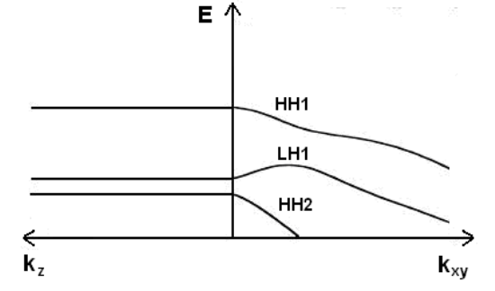
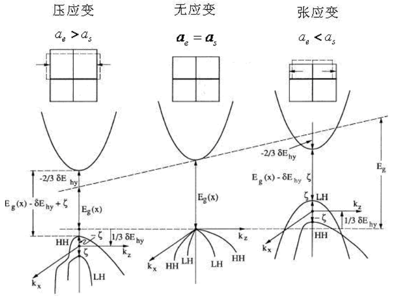
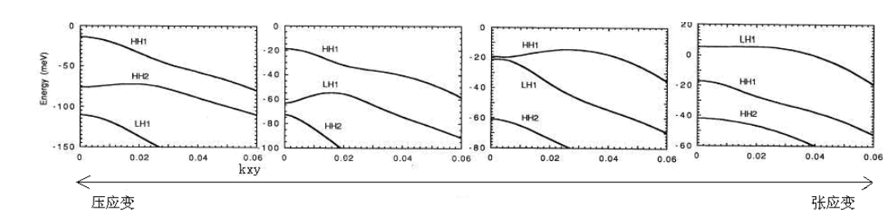

# 量子阱设计

## 偏振相关

### 无应变量子阱的能带结构

> HH代表重空穴，LH代表轻空穴

- 由于量子尺寸效应，重空穴带（HH带）和轻空穴带（LH带）在$\vec k=0$处的能量简并被解除，轻空穴（LH）带下降到了重空穴（HH）带下面

- 加强了电子在导带与重空穴子带之间的跃迁
  
> 该跃迁过程只提供TE模式的增益，对TM模式无贡献

- 抑制了电子在导带与轻空穴子带之间的跃迁
  
> 该跃迁过程绝大部分提供TM模式的增益，少数部分提供TM模式的增益

- **无应力**变量子阱条件下，TE模的材料增益大于TM模的材料增益

### 应变量子阱的能带结构

#### 应变作用下体材料能带结构的变化

#### 应变作用下量子阱能带结构的变化

### 应变类型对增益偏振相关性的影响

- 加入应变能够有效提高量子阱的增益
  - **压应变**量子阱中，**TE模式增益较大**：重空穴子带上升，轻空穴子带下降，压应变量较大时，价带前三个子带均为重空穴带
  - **张应变**量子阱中，**TM模式增益较大**：轻空穴子带上升，重空穴带下降，张应变量较大时，轻空穴子带成为价带第一子带

- 在量子阱中引入张应变是实现TE、TM模式输出功率均衡的有效途径

  > 在SLD设计中，压应变量子阱和张应变量子阱组合的**复合量子阱设计**能够使TE、TM增益均衡，实现**偏振不敏感SLD**

### 量子阱厚度对增益偏振相关性的影响

- 阱宽较小时，张应变对LH1的提升作用较小；随着阱厚增加，量子限制效应被削弱，LH1最终成为价带的第一子带

- 随着阱厚度加大，TM模式的材料增益增加，TE模式的材料增益被抑制

  > 阱的厚度不能超过维持弹性应变的[临界厚度](#临界厚度)

### $\delta$应变量子阱

## 应变量子阱

### 应变对带边能量的影响

**e.g. $In_{1-x}Ga_xAs$ on InP substrate**

#### 平面内应变

$$
\varepsilon=\varepsilon_{xx}=\varepsilon_{yy}=\frac{a_0-a(x)}{a_0}
$$
其中，$a_0$是InP衬底的晶格常数。对于压应变，$\varepsilon<0$；对于张应变，$\varepsilon>0$

#### 垂直方向上的应变

$$
\varepsilon_\perp=\varepsilon_{zz}=-2\frac{\sigma}{1-\sigma}\varepsilon=-2\frac{C_{12}}{C_{11}}\varepsilon
$$
其中，$\sigma$为泊松比，$C_{11}$和$C_{12}$为弹性刚度系数。对于大多数III-V族化合物半导体，$\sigma\approx1/3$ 或 $C_{12}\approx0.5C_{11}$

#### 导带边的位移量

$$
\delta E_c=a_c(\varepsilon_{xx}+\varepsilon_{yy}+\varepsilon_{zz})=2a_c\left(1-\frac{C_{12}}{C_{11}}\right)\varepsilon
$$
其中，$a_c$为导带形变势

#### 价带子带的位移量

$$
\delta E_{HH}=-P_{\varepsilon}-Q_{\varepsilon},\quad\quad\delta E_{LH}=-P_{\varepsilon}+Q_{\varepsilon}\\
P_{\varepsilon}=-a_v(\varepsilon_{xx}+\varepsilon_{yy}+\varepsilon_{zz})=-2a_v\left(1-\frac{C_{12}}{C_{11}}\right)\varepsilon\\
Q_{\varepsilon}=-\frac{b}{2}(\varepsilon_{xx}+\varepsilon_{yy}-2\varepsilon_{zz})=-2b\left(1+2\frac{C_{12}}{C_{11}}\right)\varepsilon
$$
其中，$a_v$为价带形变势，$b$为剪切形变势

#### 新带边

$$
E_c=E_g(x)+\delta E_c\\
E_{HH}=\delta E_{HH}=-P_{\varepsilon}-Q_{\varepsilon}\\
E_{LH}=\delta E_{LH}=-P_{\varepsilon}+Q_{\varepsilon}
$$

#### 有效带隙

$$
\begin{aligned}
E_{C-HH}&=E_g(x)+\delta E_c-\delta E_{HH}=E_g(x)+\delta E_c+P_{\varepsilon}+Q_{\varepsilon}\\
&=E_g(x)+2a\left(1-\frac{C_{12}}{C_{11}}\right)\varepsilon-b\left(1+2\frac{C_{12}}{C_{11}}\right)\varepsilon\\
E_{C-LH}&=E_g(x)+\delta E_c-\delta E_{LH}=E_g(x)+\delta E_c+P_{\varepsilon}-Q_{\varepsilon}\\
&=E_g(x)+2a\left(1-\frac{C_{12}}{C_{11}}\right)\varepsilon+b\left(1+2\frac{C_{12}}{C_{11}}\right)\varepsilon
\end{aligned}
$$
其中，$a=a_c-a_v$为流体静力学形变势，单位为$eV$

### 临界厚度

- 晶格失配的外延层存在一个临界厚度$h_c$，若超过临界厚度，则弹性应变被破坏，用来补偿弹性应变所需的能量将超过形成位错的某能量值，从而形成大量位错

- 若外延层厚度足够薄，只要失配率不是很大（<7%），则能保持弹性应变的能量小于形成位错的能量

- 由[Matthews和Blakeslee的力平衡模型](https://aip.scitation.org/doi/abs/10.1063/1.95783)计算的$h_c$为：
  $$
  h_c=\frac{a}{K\sqrt{2}\pi\varepsilon}\cdot\frac{1-\sigma/4}{1+\sigma}\left(\ln\frac{\sqrt{2}h_c}{a}+1\right)
  $$
  式中，$a_0$为衬底晶格常数，$a$为外延层晶格常数，$\varepsilon$为应力，$\varepsilon=\dfrac{a_0-a}{a_0}$，$\sigma$为泊松比，$\sigma=\dfrac{C_{12}}{C_{11}+C_{12}}$，$K$为常数，对于单量子阱为4，对于多量子阱为2

### 确定应变量子阱的厚度

在临界厚度的范围内，当有源区量子阱采用不同阱宽时，可以进一步加大光谱的宽度。

> 量子阱的阱宽不同使阱内子能级高度不同，从而使不同阱层的发射光谱有一定的偏移。通过这种不同峰值波长的光谱叠加可有效增加光谱宽度

根据Knoig-Pengey模型，列出薛定谔方程：
$$
\left[-\frac{h^2}{2m^*}\frac{d^2}{dz^2}+V(z)\right]f(z)=\left[E-\frac{h^2k^2}{2m^*}\right]f(z)
$$
其中
$$
V(z)=\begin{cases}
0 & -\dfrac{L_w}{2}<z<\dfrac{L_w}{2}\\
V_0 & z\leq-\dfrac{L_w}{2},z\geq\dfrac{L_w}{2}
\end{cases}
$$
方程中$E$为阱中电子或空穴的能量，$V_0$为势垒高度，$L_w$为阱宽，$m^*$为阱中电子或空穴的有效质量，$h$为普朗克常数，对于电子$V_0=\Delta E_c$，对于空穴$V_0=\Delta E_v$，其中$\Delta E_c$、$\Delta E_v$分别是两种材料的导带和价带的带阶（不连续值）。

求解薛定谔方程，得到本征值方程：
$$
k_1=\begin{cases}
k_2\cdot\tan\left(k_2\dfrac{L_w}{2}\right) & n=1,3,5,...\\
-k_2\cdot ctg\left(k_2\dfrac{L_w}{2}\right) & n=2,4,6,...
\end{cases}
$$
其中
$$
\begin{cases}
k_1=\sqrt{\dfrac{2m^*(V_0-E)}{h^2}}\\
k_2=\sqrt{\dfrac{2m^*E}{h^2}}
\end{cases}
$$
主要考虑阱中电子基态C1​（$n=1$）和空穴基态（HH1​/LH1）($n=1$）这两者之间的跃迁，则有
$$
\tan\left(k_2\dfrac{L_w}{2}\right)=\frac{k_1}{k_2}
$$
可得理论量子阱宽度为：
$$
L_w=2\frac{\arctan(k_1/k_2)}{k_2}
$$
波长的表达式可近似为：
$$
\lambda(\mu m)\approx\frac{1.24}{(E_g+E_{C1}+E_{HH1/LH1})(eV)}
$$

